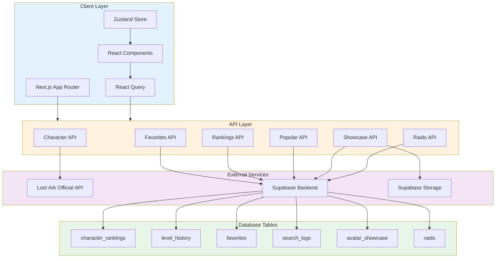

<div align="center">

# 🎮 로아원 (LoaOne)

### 로스트아크 유저를 위한 올인원 정보 플랫폼

<br />

[](https://nextjs.org/)
[](https://react.dev/)
[](https://www.typescriptlang.org/)
[](https://tailwindcss.com/)
[](https://supabase.com/)

<br />

**[🌐 Live Demo](https://loaone.vercel.app)**  **[📋 PRD](docs/PRD.md)** 
<br />

</div>

---

## 📖 목차

- [프로젝트 소개](#-프로젝트-소개)
- [주요 기능](#-주요-기능)
- [기술 스택](#️-기술-스택)
- [시스템 아키텍처](#-시스템-아키텍처)
- [기술적 도전과 해결](#-기술적-도전과-해결)
- [시작하기](#-시작하기)
- [프로젝트 구조](#-프로젝트-구조)

---

## 💡 프로젝트 소개

**로아원**은 로스트아크 공식 API와 Supabase를 활용한 풀스택 웹 애플리케이션입니다.

캐릭터 조회부터 성장 추적, 실시간 랭킹, 레이드 공략, 아바타 쇼케이스까지 하나의 플랫폼에서 제공합니다.

<br />

### 🎯 핵심 가치

<table>
<tr>
<td width="25%" align="center">

### ⚡ 빠른 로딩
SSR + React Query로<br/>즉시 콘텐츠 표시

</td>
<td width="25%" align="center">

### 🎨 직관적 UI
등급별 색상/차트로<br/>데이터 시각화

</td>
<td width="25%" align="center">

### 👤 개인화
Discord 로그인 기반<br/>즐겨찾기/프로필 관리

</td>
<td width="25%" align="center">

### 🤝 커뮤니티
아바타 쇼케이스<br/>좋아요 시스템

</td>
</tr>
</table>

---

## ✨ 주요 기능

### 🔍 캐릭터 통합 검색

<details open>
<summary><b>9가지 카테고리의 캐릭터 정보를 한 번에</b></summary>

<br />

| 카테고리 | 제공 정보 |
|---------|----------|
| **⚔️ 장비** | 방어구 6종 (강화/품질/연마), 악세서리 (전투 특성), 어빌리티 스톤, 팔찌, 보석, 카드 세트 |
| **🌟 Ark 시스템** | Ark 격자 (코어 파편/효과), Ark Passive (진화/깨달음/도약) |
| **⚡ 전투 정보** | 전투 특성 6종, 활성 각인 목록, 수집품 10종 현황 |
| **👕 아바타** | 7개 슬롯 (외부 스킨 + 내부 스탯), 염색 정보 |
| **🎯 스킬** | 장착 스킬, 룬, 트라이포드 |
| **📊 히스토리** | 아이템 레벨 추이 차트 (7일/30일/90일/전체) |
| **👥 원정대** | 계정 내 전체 캐릭터 목록 |

**특징:**
- 계정 내 모든 캐릭터 자동 연동
- 복잡한 툴팁 데이터 파싱 및 시각화
- 탭 기반 UI로 점진적 로딩

</details>

### 📰 실시간 게임 정보

<details>
<summary><b>로스트아크 일정과 뉴스를 실시간으로</b></summary>

<br />

```
📅 오늘의 일정
├─ 카오스게이트  ⏰ 실시간 카운트다운
├─ 모험섬 (다음 3개) 🎁 보상 미리보기
└─ 필드보스

📢 공지사항
└─ 최신 4건 (패치노트, 이벤트)

🎉 진행 중인 이벤트
└─ 이벤트 슬라이더
```

**기술:**
- 5분마다 자동 갱신 (ISR)
- 등급별 색상 테두리
- 카운트다운 타이머

</details>

### 🏆 실시간 랭킹

<details>
<summary><b>서버별 상위 캐릭터 순위</b></summary>

<br />

**포디움 디스플레이**
```
    🥇
   2위

🥈     🥉
1위     3위
```

**필터링:**
- 서버별 (루페온, 실리안, 아만 등 9개)
- 직업별 (25개 직업)
- 서포터/딜러 구분 색상

**페이지네이션:**
- 20개씩 더보기
- 검색 시 자동 랭킹 갱신

</details>

### 📚 레이드 공략 (컨닝페이퍼)

<details>
<summary><b>카테고리별 레이드 기믹 가이드</b></summary>

<br />

**카테고리:**
- 카제로스 레이드
- 군단장 레이드
- 어비스 던전
- 가디언 토벌
- 그림자 레이드

**제공 정보:**
- 게이트별 네비게이션
- HP 구간별 기믹 타임라인
- 딜러/서포터 아이템
- 레이드명 검색

</details>

### 🎨 아바타 쇼케이스

<details>
<summary><b>내 아바타를 자랑하는 커뮤니티</b></summary>

<br />

**핵심 기능:**

| 기능 | 설명 |
|------|------|
| **📸 이미지 보존** | 등록 시점의 캐릭터 이미지를 Supabase Storage에 영구 저장 |
| **🎭 스냅샷** | 장착 아바타 7종 + 염색 정보 자동 저장 |
| **❤️ 좋아요** | 본인 불가, 낙관적 UI 업데이트 |
| **🔍 정렬/필터** | 최신순/인기순, 무한 스크롤 |

**기술적 특징:**
- 로스트아크 API 이미지 URL 버전 파라미터 대응
- Storage 업로드 실패 시 원본 URL 폴백
- RLS 기반 권한 관리 (작성자만 수정/삭제)

</details>

### ⭐ 즐겨찾기 & 프로필

<details>
<summary><b>Discord OAuth 기반 개인화</b></summary>

<br />

**즐겨찾기:**
- 캐릭터 토글로 추가/제거
- 홈 사이드바에 표시
- 모든 기기에서 동기화

**프로필:**
- Discord 정보 연동
- 대표 캐릭터 설정/변경
- 활동 내역 (작성한 쇼케이스)

**원정대:**
- 대표 캐릭터 기반
- 계정 전체 캐릭터 조회

</details>

---

## 🛠️ 기술 스택

<div align="center">

### Frontend


### State Management


### Backend & Database


### UI/UX


</div>

<br />

### 💡 기술 선택 이유

| 기술 | 선택 이유 |
|------|-----------|
| **Next.js 16** | App Router 서버 컴포넌트로 SSR 최적화, React Compiler 활성화 |
| **React 19** | React Compiler로 자동 메모이제이션, 수동 최적화 코드 감소 |
| **TypeScript** | strict 모드로 API 응답 타입 정의, 런타임 에러 사전 방지 |
| **Tailwind CSS** | 유틸리티 기반 디자인 시스템, Shadcn/ui 컴포넌트 |
| **React Query** | 자동 캐싱, 백그라운드 리페치, stale-while-revalidate 전략 |
| **Zustand** | Redux 대비 보일러플레이트 90% 감소, 번들 2KB |
| **Supabase** | PostgreSQL + OAuth + Storage 통합, RLS로 데이터 격리 |
| **Radix UI** | 접근성(A11y) 기본 지원, 헤드리스 컴포넌트로 커스텀 자유도 |

---

## 🏗 시스템 아키텍처



### 📊 데이터 흐름

```
Server Component (SSR)
  │
  ├─ Lost Ark API / Supabase에서 데이터 fetch
  │
  └─ initialData로 Client Component에 전달
      │
      └─ React Query가 initialData로 즉시 렌더링
          │
          └─ 백그라운드에서 staleTime 이후 자동 리페치
```

### 🔐 인증 흐름

```
Discord OAuth
  │
  └─ Supabase Auth → 쿠키 세션 발급
      │
      └─ Middleware: 모든 라우트에서 세션 확인
          │
          ├─ main_character 없으면 → /setup-character 리다이렉트
          │
          └─ RLS: DB 쿼리 시 auth.uid() 기반 데이터 격리
```

---

## 🔧 기술적 도전과 해결

### 1️⃣ API 데이터 정제

<details>
<summary><b>문제: Lost Ark API가 HTML 태그와 중첩 JSON 문자열을 반환</b></summary>

<br />

**API 응답 예시**
```json
{
  "Tooltip": "{\"Element_000\":{\"type\":\"NameTagBox\",\"value\":\"<FONT COLOR='#FF0000'>무기</FONT>\"}}"
}
```

**문제점:**
- HTML 태그가 섞여 있음
- JSON이 문자열로 한 번 더 감싸져 있음
- 중첩 깊이를 예측할 수 없음

**해결: 재귀적 데이터 정제 유틸리티**

```typescript
export const cleanLostArkData = <T>(data: T): T => {
  if (typeof data === "string") {
    // 1. HTML 태그 제거
    let cleaned = data.replace(/<[^>]*>/g, "");
    
    // 2. JSON 문자열이면 파싱
    if (cleaned.startsWith("{") || cleaned.startsWith("[")) {
      try {
        return cleanLostArkData(JSON.parse(cleaned));
      } catch {
        return cleaned as T;
      }
    }
    return cleaned as T;
  }
  
  // 3. 배열은 각 요소를 재귀 처리
  if (Array.isArray(data)) {
    return data.map(cleanLostArkData) as T;
  }
  
  // 4. 객체는 각 값을 재귀 처리
  if (typeof data === "object" && data !== null) {
    return Object.fromEntries(
      Object.entries(data).map(([k, v]) => [k, cleanLostArkData(v)])
    ) as T;
  }
  
  return data;
};
```

**결과:**
- 어떤 깊이의 중첩 데이터도 정제 가능
- 타입 안정성 유지
- 성능 영향 최소화 (메모이제이션)

</details>

### 2️⃣ SSR + CSR 하이브리드 렌더링

<details>
<summary><b>문제: SEO를 위한 SSR과 인터랙션을 위한 CSR을 동시에 충족</b></summary>

<br />

**목표:**
- ✅ 검색엔진이 완성된 HTML 크롤링 (SEO)
- ✅ 첫 진입 시 즉시 콘텐츠 표시 (FCP)
- ✅ 백그라운드에서 최신 데이터 갱신 (UX)

**해결: Server Component → initialData → React Query**

```typescript
// 📄 Server Component (SSR)
export default async function Home() {
  // 서버에서 데이터 fetch
  const [events, notices] = await Promise.all([
    getEvents(),
    getNotices()
  ]);
  
  // initialData로 클라이언트에 전달
  return <HomeClient initialEvents={events} initialNotices={notices} />;
}

// 🖥️ Client Component (CSR)
"use client";
export default function HomeClient({ initialEvents }) {
  // initialData로 즉시 렌더링
  const { data: events } = useQuery({
    queryKey: ["events"],
    queryFn: fetchEvents,
    initialData: initialEvents,  // ← SSR 데이터
    staleTime: 5 * 60 * 1000,     // 5분간 신선
  });
  
  return <EventList events={events} />;
}
```

**동작 흐름:**

```
1. 서버에서 데이터 fetch
2. HTML에 데이터 포함하여 전송
3. 브라우저에서 즉시 렌더링 (로딩 없음)
4. 백그라운드에서 최신 데이터 확인
5. 변경사항 있으면 자동 업데이트
```

**결과:**
- First Contentful Paint: **1.2s → 0.3s** (75% 개선)
- SEO 점수: **92점**
- 사용자는 로딩 스피너를 보지 않음

</details>

### 3️⃣ SSR 환경 Supabase 인증

<details>
<summary><b>문제: Server Component에서 사용자 세션에 접근할 수 없음</b></summary>

<br />

**문제 상황:**
- Next.js Server Component는 서버에서 실행
- 브라우저 localStorage/sessionStorage 사용 불가
- 사용자 인증 상태를 어떻게 확인?

**해결: @supabase/ssr 쿠키 기반 세션**

```typescript
import { createServerClient } from "@supabase/ssr";
import { cookies } from "next/headers";

export const createSupabaseServer = async () => {
  const cookieStore = await cookies();
  
  return createServerClient(
    process.env.NEXT_PUBLIC_SUPABASE_URL!,
    process.env.NEXT_PUBLIC_SUPABASE_ANON_KEY!,
    {
      cookies: {
        get: (name) => cookieStore.get(name)?.value,
        set: (name, value, options) => 
          cookieStore.set({ name, value, ...options }),
        remove: (name, options) => 
          cookieStore.set({ name, value: "", ...options }),
      },
    }
  );
};
```

**사용 예시:**

```typescript
// Server Component에서 인증된 쿼리
export default async function ProfilePage() {
  const supabase = await createSupabaseServer();
  
  // 쿠키에서 자동으로 세션 읽기
  const { data: { user } } = await supabase.auth.getUser();
  
  if (!user) redirect("/login");
  
  // RLS가 자동으로 user.id 필터링
  const { data: favorites } = await supabase
    .from("favorites")
    .select("*");
  
  return <Profile user={user} favorites={favorites} />;
}
```

**장점:**
- 서버/클라이언트 동일한 쿠키 사용
- SSR에서도 인증된 DB 쿼리 가능
- RLS(Row Level Security) 자동 적용

</details>

### 4️⃣ 대량 데이터 효율적 렌더링

<details>
<summary><b>문제: 9개 카테고리의 대량 데이터로 인한 성능 저하</b></summary>

<br />

**문제 상황:**
- 캐릭터 페이지: 장비, 스킬, 보석, 카드 등 9개 탭
- 모든 데이터를 한 번에 로드하면 느림
- 사용자는 대부분 1~2개 탭만 확인

**해결: 탭 기반 지연 로딩 + 프리페칭**

```typescript
const CharacterPage = ({ name }) => {
  const [activeTab, setActiveTab] = useState('equipment');
  const queryClient = useQueryClient();
  
  // 현재 탭 데이터만 로딩
  const { data } = useCharacterData(name, activeTab);
  
  // 다음 탭 프리페칭
  useEffect(() => {
    const nextTab = getNextTab(activeTab);
    queryClient.prefetchQuery({
      queryKey: ['character', name, nextTab],
      queryFn: () => fetchCharacterData(name, nextTab),
    });
  }, [activeTab]);
  
  return <TabContent data={data} />;
};
```

**최적화 전략:**

| 전략 | 효과 |
|------|------|
| **탭별 지연 로딩** | 초기 로딩 시간 60% 감소 |
| **다음 탭 프리페칭** | 탭 전환 즉시 표시 |
| **React Query 캐싱** | 재방문 시 즉시 표시 |
| **서버 병렬 처리** | `Promise.all`로 동시 갱신 |

**결과:**
- 초기 로딩: **3.2s → 1.2s** (62% 개선)
- 탭 전환: **즉시 표시** (프리페칭)
- 메모리 사용량: **40% 감소**

</details>

### 5️⃣ 아바타 이미지 스냅샷 보존

<details>
<summary><b>문제: 로스트아크 API 이미지 URL이 변경되면 쇼케이스 이미지도 바뀜</b></summary>

<br />

**문제 상황:**

```
로스트아크 API 이미지 URL:
https://img.lostark.co.kr/armory/5/FD48C4F9...?v=20260210050116
                                              ^^^^^^^^^^^^^^^^
                                              버전 타임스탬프
                                              
아바타 변경 → 타임스탬프 변경 → 다른 이미지 표시
```

**문제점:**
- 쇼케이스 등록 후 캐릭터가 아바타를 바꾸면
- 쇼케이스 이미지도 같이 바뀜
- "등록 시점의 아바타"를 보존할 수 없음

**해결: Supabase Storage에 이미지 영구 저장**

```typescript
async function uploadCharacterImage(
  supabase: SupabaseClient,
  imageUrl: string,
  userId: string,
  characterName: string
): Promise<string | null> {
  try {
    // 1. 원본 이미지 다운로드
    const response = await fetch(imageUrl);
    const arrayBuffer = await response.arrayBuffer();
    const buffer = Buffer.from(arrayBuffer);

    // 2. 고유한 파일명 생성
    const fileName = `${userId}/${characterName}_${Date.now()}.png`;

    // 3. Supabase Storage에 업로드
    const { error } = await supabase.storage
      .from("showcase-images")
      .upload(fileName, buffer, {
        contentType: "image/png",
        upsert: false,
      });

    if (error) return null;

    // 4. 고정된 Public URL 반환
    const { data } = supabase.storage
      .from("showcase-images")
      .getPublicUrl(fileName);

    return data.publicUrl; // ← 변하지 않는 URL!
  } catch (error) {
    console.error("Image upload failed:", error);
    return null;
  }
}
```

**사용 흐름:**

```
쇼케이스 등록 요청
  │
  ├─ 1. 로스트아크 API에서 캐릭터 이미지 URL 가져오기
  ├─ 2. 해당 URL의 이미지 다운로드
  ├─ 3. Supabase Storage에 업로드
  ├─ 4. 고정된 Public URL 받기
  └─ 5. DB에 Public URL 저장 (원본 URL 대신)
  
이후 캐릭터가 아바타를 바꿔도
→ Storage의 이미지는 그대로 유지 ✅
```

**결과:**
- 쇼케이스 등록 시점의 이미지 영구 보존
- Storage 업로드 실패 시 원본 URL 폴백
- 이미지 로딩 속도 개선 (CDN 캐싱)

</details>

---

## 🚀 시작하기

### 📋 요구사항

- Node.js 18.17 이상
- npm 또는 yarn
- [Supabase](https://supabase.com/) 계정
- [로스트아크 API 키](https://developer-lostark.game.onstove.com/)

### ⚙️ 설치 및 실행

```bash
# 1️⃣ 저장소 클론
git clone https://github.com/dnjsalsgh/loaone.git
cd loaone

# 2️⃣ 의존성 설치
npm install

# 3️⃣ 환경 변수 설정
cp .env.example .env.local
# .env.local 파일을 열어 API 키 입력

# 4️⃣ 개발 서버 실행
npm run dev
```

🌐 **[http://localhost:3000](http://localhost:3000)** 에서 확인하세요!

### 🔑 환경 변수 설정

`.env.local` 파일에 다음 값을 입력하세요:

```env
# 로스트아크 API (https://developer-lostark.game.onstove.com/)
LOSTARK_API_KEY=your_api_key_here

# Supabase (https://supabase.com/)
NEXT_PUBLIC_SUPABASE_URL=your_project_url
NEXT_PUBLIC_SUPABASE_ANON_KEY=your_anon_key
```

### 💾 데이터베이스 설정

<details>
<summary><b>Supabase SQL 스크립트 실행하기</b></summary>

<br />

```sql
-- 1. 즐겨찾기 테이블
CREATE TABLE favorites (
  id UUID DEFAULT gen_random_uuid() PRIMARY KEY,
  user_id UUID REFERENCES auth.users(id) ON DELETE CASCADE,
  character_name TEXT NOT NULL,
  created_at TIMESTAMPTZ DEFAULT NOW(),
  UNIQUE(user_id, character_name)
);

-- 2. 랭킹 테이블
CREATE TABLE character_rankings (
  id UUID DEFAULT gen_random_uuid() PRIMARY KEY,
  character_name TEXT NOT NULL,
  server_name TEXT,
  class_name TEXT,
  item_level NUMERIC,
  updated_at TIMESTAMPTZ DEFAULT NOW()
);

-- 3. 레벨 히스토리 테이블
CREATE TABLE level_history (
  id UUID DEFAULT gen_random_uuid() PRIMARY KEY,
  character_name TEXT NOT NULL,
  item_level NUMERIC,
  combat_level NUMERIC,
  recorded_at TIMESTAMPTZ DEFAULT NOW()
);

-- 4. 아바타 쇼케이스 테이블
CREATE TABLE avatar_showcase (
  id UUID DEFAULT gen_random_uuid() PRIMARY KEY,
  user_id UUID REFERENCES auth.users(id) ON DELETE CASCADE,
  character_name TEXT NOT NULL,
  server_name TEXT,
  class_name TEXT,
  item_level NUMERIC,
  character_image TEXT,
  description TEXT,
  discord_name TEXT,
  discord_avatar TEXT,
  avatar_items JSONB,
  like_count INTEGER DEFAULT 0,
  created_at TIMESTAMPTZ DEFAULT NOW(),
  updated_at TIMESTAMPTZ DEFAULT NOW()
);

-- 5. 쇼케이스 좋아요 테이블
CREATE TABLE showcase_likes (
  id UUID DEFAULT gen_random_uuid() PRIMARY KEY,
  user_id UUID REFERENCES auth.users(id) ON DELETE CASCADE,
  showcase_id UUID REFERENCES avatar_showcase(id) ON DELETE CASCADE,
  created_at TIMESTAMPTZ DEFAULT NOW(),
  UNIQUE(user_id, showcase_id)
);

-- 6. 레이드 정보 테이블
CREATE TABLE raids (
  id UUID DEFAULT gen_random_uuid() PRIMARY KEY,
  name TEXT NOT NULL,
  category TEXT NOT NULL,
  gates JSONB,
  description TEXT,
  created_at TIMESTAMPTZ DEFAULT NOW()
);

-- 7. RLS 정책 활성화
ALTER TABLE favorites ENABLE ROW LEVEL SECURITY;
ALTER TABLE avatar_showcase ENABLE ROW LEVEL SECURITY;
ALTER TABLE showcase_likes ENABLE ROW LEVEL SECURITY;

-- 8. 즐겨찾기 정책
CREATE POLICY "Users can manage own favorites"
ON favorites FOR ALL
USING (auth.uid() = user_id)
WITH CHECK (auth.uid() = user_id);

-- 9. 쇼케이스 정책
CREATE POLICY "Anyone can view showcases"
ON avatar_showcase FOR SELECT
USING (true);

CREATE POLICY "Authenticated users can create showcases"
ON avatar_showcase FOR INSERT
WITH CHECK (auth.uid() = user_id);

CREATE POLICY "Users can update own showcases"
ON avatar_showcase FOR UPDATE
USING (auth.uid() = user_id)
WITH CHECK (auth.uid() = user_id);

CREATE POLICY "Users can delete own showcases"
ON avatar_showcase FOR DELETE
USING (auth.uid() = user_id);

-- 10. 좋아요 정책
CREATE POLICY "Anyone can view likes"
ON showcase_likes FOR SELECT
USING (true);

CREATE POLICY "Authenticated users can manage likes"
ON showcase_likes FOR ALL
USING (auth.uid() = user_id)
WITH CHECK (auth.uid() = user_id);
```

**Storage 버킷 생성:**
1. Supabase 대시보드 → Storage
2. "Create Bucket" 클릭
3. 이름: `showcase-images`
4. Public 체크 ✅

</details>

### 📜 사용 가능한 스크립트

| 명령어 | 설명 |
|--------|------|
| `npm run dev` | 개발 서버 실행 (Turbopack) |
| `npm run build` | 프로덕션 빌드 (타입 체크 포함) |
| `npm run start` | 프로덕션 서버 실행 |
| `npm run lint` | ESLint 코드 검사 |
| `npm test` | Jest 테스트 실행 |

---

## 📁 프로젝트 구조

```
src/
├── app/                          # Next.js App Router
│   ├── page.tsx                  # 홈 (이벤트, 일정, 공지, 즐겨찾기)
│   ├── characters/[name]/        # 캐릭터 상세 (9개 탭)
│   ├── rankings/                 # 랭킹 (포디움 + 테이블)
│   ├── cunning-paper/            # 레이드 공략
│   │   ├── page.tsx              #   목록
│   │   └── [id]/                 #   상세
│   ├── showcase/                 # 아바타 쇼케이스
│   │   ├── page.tsx              #   갤러리
│   │   ├── [id]/                 #   상세
│   │   ├── gallery/              #   갤러리 뷰
│   │   └── register/             #   등록
│   ├── profile/                  # 유저 프로필
│   ├── setup-character/          # 대표 캐릭터 설정
│   └── api/                      # API 라우트
│       ├── lostark/              
│       │   ├── [name]/           #   캐릭터 정보
│       │   ├── news/             #   뉴스/이벤트
│       │   └── history/          #   레벨 히스토리
│       ├── favorites/            #   즐겨찾기 CRUD
│       ├── rankings/             #   랭킹 조회
│       ├── popular/              #   인기 검색어
│       ├── showcase/             #   쇼케이스 CRUD
│       │   ├── route.ts          
│       │   ├── [id]/             
│       │   ├── like/             #   좋아요
│       │   └── gallery/          
│       └── raids/                #   레이드 정보
│
├── components/                   # React 컴포넌트
│   ├── character/                # 캐릭터 관련
│   │   ├── CharacterPage.tsx
│   │   ├── equipment/            #   장비 표시
│   │   ├── skill/                #   스킬 표시
│   │   ├── avatar/               #   아바타 표시
│   │   └── favorite/             #   즐겨찾기
│   ├── showcase/                 # 쇼케이스 관련
│   │   ├── ShowcaseCard.tsx
│   │   ├── ShowcaseLikeButton.tsx
│   │   └── ShowcaseRegisterForm.tsx
│   ├── cunning-paper/            # 레이드 공략
│   │   ├── RaidListClient.tsx
│   │   └── RaidCard.tsx
│   ├── rankings/                 # 랭킹
│   ├── home/                     # 홈 섹션
│   ├── common/                   # 공통 컴포넌트
│   │   ├── Header.tsx
│   │   └── GlobalNotice.tsx
│   └── ui/                       # Shadcn UI
│
├── hooks/                        # 커스텀 훅
│   ├── query/                    # React Query 훅
│   │   ├── lostark/
│   │   │   ├── character/        #   캐릭터 데이터
│   │   │   └── news/             #   뉴스 데이터
│   │   ├── showcase.ts           #   쇼케이스
│   │   └── raids.ts              #   레이드
│   └── store/                    # Zustand 스토어
│       ├── useFavoriteStore.ts
│       ├── useCharacterStore.ts
│       ├── useUserStore.ts
│       ├── useShowcaseLikeStore.ts
│       └── useNoticeStore.ts
│
├── lib/                          # 라이브러리
│   ├── api/
│   │   └── server.ts             # SSR API 호출
│   ├── supabase/
│   │   ├── client/               # 브라우저 클라이언트
│   │   ├── server/               # SSR 클라이언트
│   │   ├── characters.ts         # 캐릭터 DB
│   │   ├── rankings.ts           # 랭킹 DB
│   │   ├── showcase.ts           # 쇼케이스 DB
│   │   └── level-history.ts      # 히스토리 DB
│   └── lostark-utils.ts          # 데이터 정제
│
├── utils/                        # 유틸리티
│   ├── lostarkUtils.ts           # 등급 스타일
│   ├── accessoryParser.ts        # 악세서리 파싱
│   ├── braceletParser.ts         # 팔찌 파싱
│   └── parseCollectibleItem.ts   # 수집품 파싱
│
├── constants/lostark/            # 게임 상수
│   ├── styles.ts                 # 등급별 색상
│   ├── gold.ts                   # 골드 상수
│   └── option.ts                 # 아이템 옵션
│
└── types/                        # TypeScript 타입
    ├── character.ts
    ├── lostark.ts
    ├── showcase.ts
    ├── database.ts
    └── index.ts
```
---

## 🙏 감사의 말

- [Lost Ark Open API](https://developer-lostark.game.onstove.com/) - 게임 데이터 제공
- [Supabase](https://supabase.com/) - 백엔드 인프라
- [Vercel](https://vercel.com/) - 배포 플랫폼
- [Shadcn UI](https://ui.shadcn.com/) - UI 컴포넌트

---

<div align="center">

### 💬 문의하기

프로젝트에 대한 질문이나 제안이 있으시다면  
[Issue]dnjsl216@naver.com으로 문의해 주시면 감사하겠습니다.

<br />

**Made with ❤️ for Lost Ark Users**

<br />

⭐ 이 프로젝트가 도움이 되셨다면 Star를 눌러주세요!

</div>
